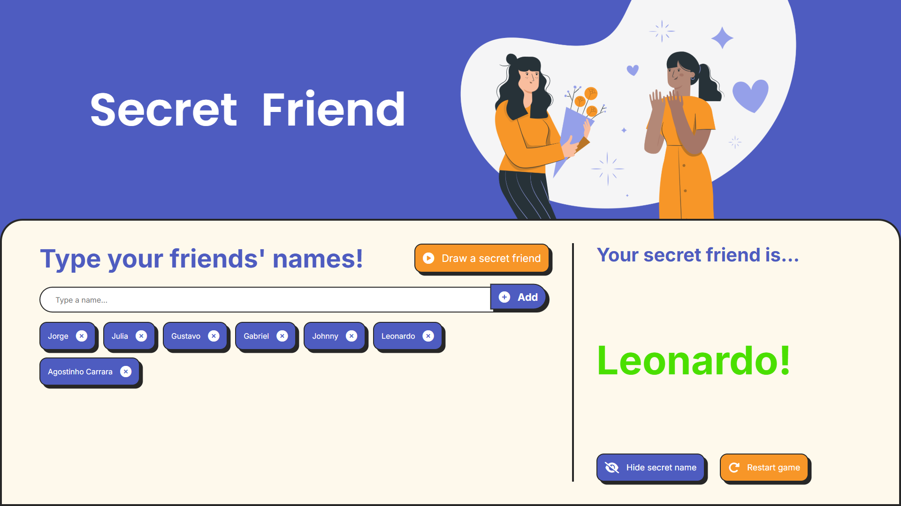

# ONE: Oracle Next Education

# Secret Friend Challenge

[<ins>Click here for live preview!</ins>](https://gummms.github.io/challengeSecretFriend_en/)

Website that runs a Secret Friend game. Made with HTML, CSS and JavaScript for studies and portfolio purposes only. This assignment is part of the ONE: Oracle Next Education program.

## Features

- Can add or remove as many names as you want;
- Randomly picks a name to be your Secret Friend;
- Buttons are disabled as long as they can't do their job;
- Can hide the name of the last name drawn in order to not spoil the secret when playing with more than one person;
- Restart button (clears every entry and data to start a fresh game);
- Buttons with nice pressing animations;
- An error message is prompted if the input is empty;
- Fully responsive!

## How does it work?

1. Stores user inputs (secret friends' names) in an array, which is updated to a list and shown in screen as it grows or shrinks;
2. When the `Draw a secret friend` button is pressed, an element from said array is picked randomly and is shown as your Secret Friend;
3. The user can then continue playing, hide the last sorted name or restart the game.

## Installation

1. Download the `app.js`, `styles.css` files and the `assets` folder;
2. Create a folder and paste all the files in it;
3. Run the code on a Live Server or in your preferred way to do so.

## Usage

1. Type the name of your friends and click `Add` or press <kbd>Enter</kbd>;
2. Names will be displayed as buttons, click on a name to remove it from the list;
3. Click on `Draw a secret friend` to randomly pick a name;
4. Click on `Hide secret name` to hide the result;
5. Click on `Restart game` to clear everything and start a fresh game.

## Screenshot

